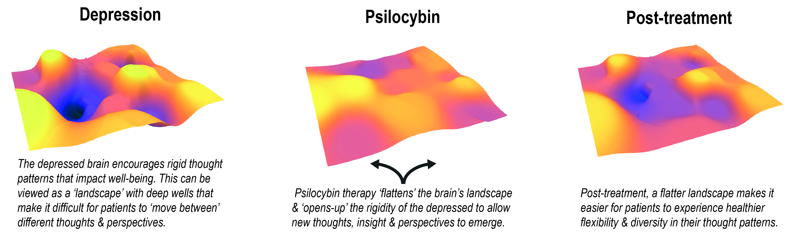
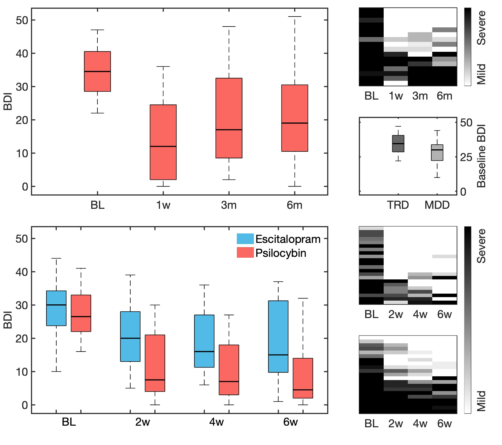
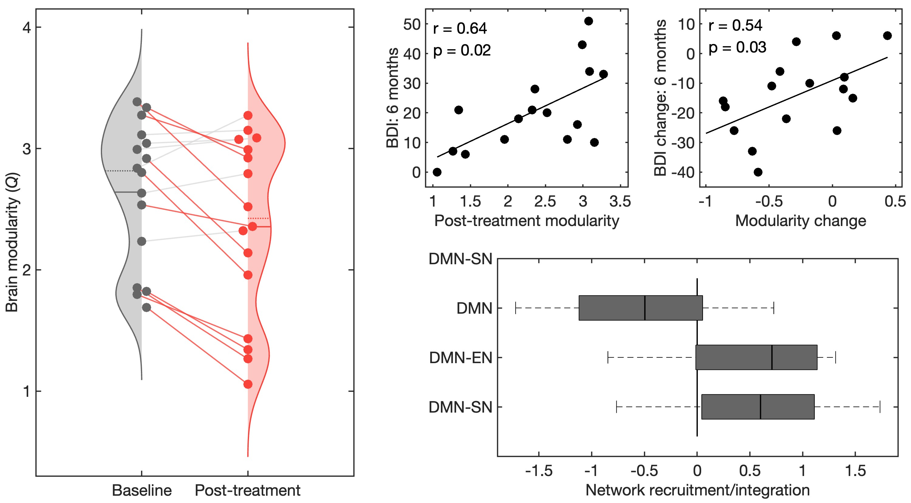
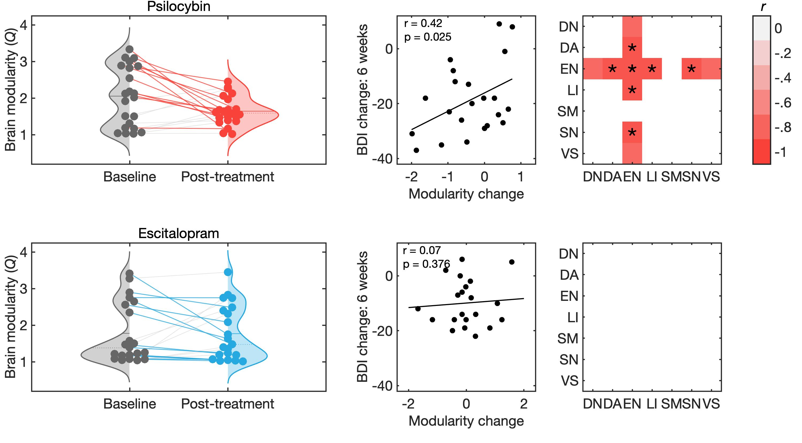

# Changes in the brain after psilocybin therapy for depression

This repo contains code for the statistical analysis and figure generation associated with the results described in: 
https://www.nature.com/articles/s41591-022-01744-z
<br>

BLUF: The evidence from two independent studies suggests that psilocybin therapy can alleviate depression via an increase in the brain's functional network integration.
<br>




## Usage

Matlab codes in `functions` rely on a combination of custom and 3rd-party toolboxes. These are held in `third_party` and need to be in the Matlab path for the code to run. 


The modularity estimation was heavily inspired by Karolina Finc's Nature Communications paper on working memory: https://www.nature.com/articles/s41467-020-15631-z

The below calls a function that returns a normalised moadularity value (Q) estimated by the maximum true modularity value divided by the mean of a a distribution of shuffled functional connectivity matrices. 

```

% Imaging and atlas volume need to be in the same space (e.g., MNI)
imaging_volume = 4D_brain_imaging_brain
atlas_volume = 3D_regional_brain_atlas

Q_norm = calculate_static_modularity(imaging_volume, atlas_volume)

```

## Data

Summary metrics of Beck's Depression Inventory (BDI) and Brain network modularity (Q) and held in `.mat` files:

```
data/
|-- psilodep1/
|   |-- dat_1.mat
|
|-- psilodep2/
|   |-- dat_2.mat
```


## Figures
1. [BDI](#BDI)
1. [Imaging](#Imaging)
 


### Features:
- Feature 1
- Feature 2
- Feature 3


# BDI
Reductions in Beck's depression inventory (BDI) following psilocybin in study 1 (top row) are replicated in study 2 (bottom row), where improvements are significantly greater than those seen with escitalopram.
Run: ```>>> BDI_figure ```
<br>



# Imaging
Study 1, decreases in brain network modularity correlate with improvements in Beck's depression inventory (BDI) following psilocybin therapy.
Run: ```>>> Imaging_figure ```
<br>



Study 2, replicated decreases in modularity following psilocybin, but not following escitalopram treatment. Replicated correlation between reduction in modularity and BDI improvement (statistically significant with one-tailed test). This correlation between brain changes and BDI was not observed in the escitalopram group. 
Run: ```>>> Imaging_figure ```
<br>




